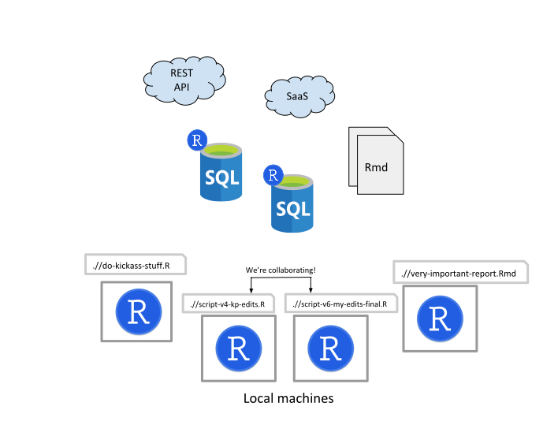
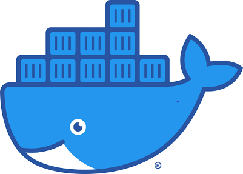
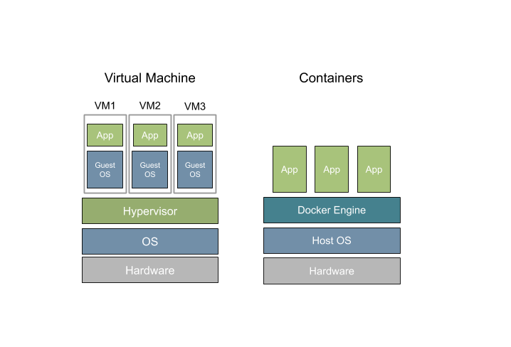

class: left, left


## Where we started...

- Developed scripts locally
  - ETL jobs, models, scoring, API calls...
- Struggled to put scheduling and logic around work flows
- Deployment was a pain

#### Early (not-so-great) solution
- Machine Learning Services for MS SQL Server
  - This only exascerbated our problems.

---



---

## What we needed:

- **Consistency** across users
- **Portability** across environments
- **Reproducibility** of results
- **Sharability** with collaborators

### Plus
- Source Code Management
- Scheduling
- Testing
- Monitoring
  
---

class: center, middle 

# So why Docker?



---

## What are containers?

* Packaged and isolated applications meant for deployment
* Decouples apps from underlying infrastructure, meaning easier source management and portability
  - Develop locally, deploy to cloud service of your choice, and run it anywhere

---

### Key concepts:

1. Host machine
2. Image
  - defined by a *Dockerfile*
3. Container
4. Data Volumes 

---

## Dockerfile
```
FROM rocker/tidyverse

RUN apt-get update \
 && apt-get install --yes --no-install-recommends \
        apt-transport-https \
        curl \
        gnupg \
        unixodbc-dev \
	odbc-postgresql \
	ssh \

COPY ./package_requirements.R /tmp/package_requirements.R

RUN Rscript /tmp/package_requirements.R

ENV USER rstudio

COPY . /home/$USER/

WORKDIR /home/$USER/

```
---
## Quick Start w/ Docker

1. Install Docker Desktop 
  - Docker's site is loaded with great setup guides
  - *(note: you'll need virtualization enabled on your machine)*
2. Open your terminal
3. Run `docker pull rocker/rstudio`
4. Run `docker run -e PASSWORD=yourpassword --rm -p 8787:8787 rocker/rstudio`
5. Open your browser and navigate to `localhost:8787`.
6. Log in with username `rstudio` and your password.

Congrats! You've deployed your first container!

---


---

## Scheduling & Workflows in **Jenkins**

- A free and open-source automation server widely used for CI/CD
- Runs in its own container and orchestrates the others
- Offers advanced scheduling, triggers, monitoring
- Builds jobs **from the Git repo**
- *Tons* of plugins and integrations


We're just scratching the surface of this tool. 

---
## Testing & Monitoring

- What can break? 
  - A test container runs daily to check database connections, API endpoints, any external resources you rely on

- Add error handling in your R code
  - Employ `stop()`, `stopifnot()`, etc. with *explicit* error messages 

### What if something goes wrong?

- We have alert channels in **Slack** where alerts from Jenkins are dropped.

---
## Source Control Management

- Using containers for R development forced us to use Git/GitHub to manage our projects
  - Includes needing pull requests and code reviews before production code is deployed

* Our infrastructure is also under version control and backed up on GitHub
  - **Infrastructure as Code**

---

## Additional benefits

Along with addressing our initial set of problems, we've also realized:

- we're forced to use more software engineering best practices
  - version control, error handling, documentation, testable code
- we can break down production code into more manageable, traceable "tasks"
  - e.g., Feature engineering and model training can be chunked out and containerized on their own
  - Can even wrap an API around each functional component
      * See: plumber example from Branden's presentation
  
- we can evolve to true CI/CD
- we reduced technical debt


---

## Resources

https://docs.docker.com/get-started/

https://www.rocker-project.org/ 

https://medium.com/tmobile-tech/r-can-api-c184951a24a3
(Series of articles that were the basis for an R Studio Conference presentation that inspired us to try Docker.)


---
class: middle, center

# Questions?


---


  


